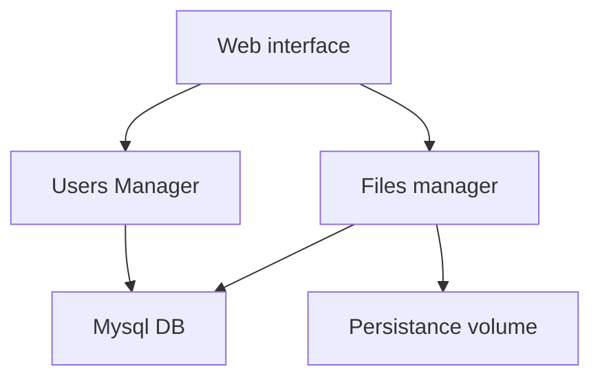
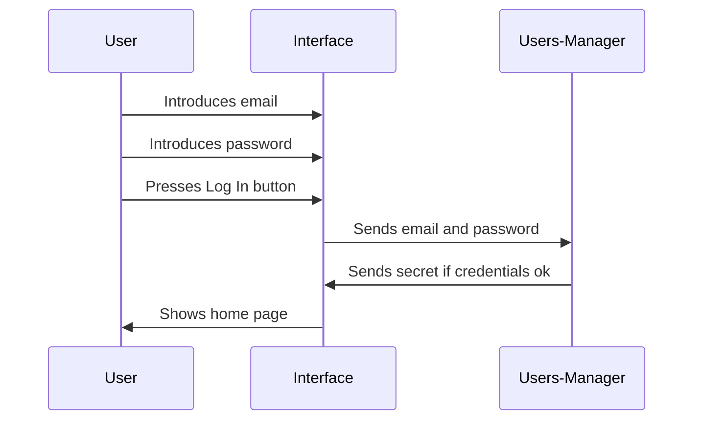
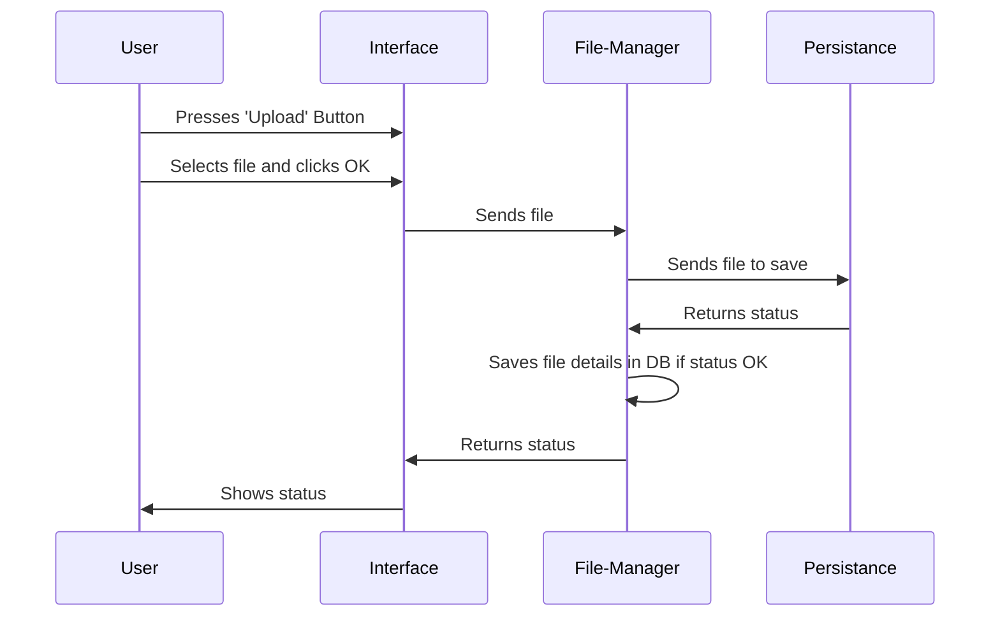
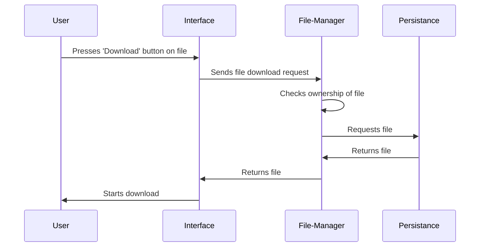
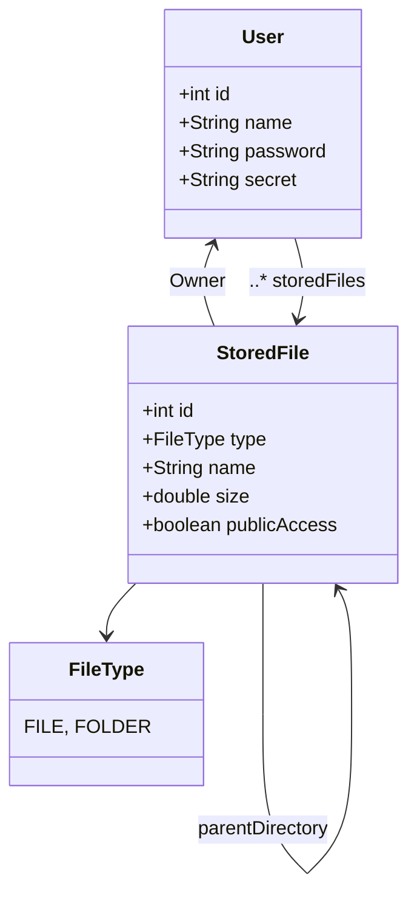

# File Storage

The theme of this project is file hosting service (like Google drive).

## Requirements from the service:
- Availability: data should be available where a connection to the server is possible
- Scalability: System storage should be upgradable as needed
- Durability: Files will not be lost
 

## User requirements:
- Users should be able to download or upload their files
- Users should be able to make their files publicly available
- System should support up to medium-sized files of 200MB

## Design considerations:
- Huge read and write volumes
- Read/Write ratio should be around 2:1 (two reads for one write)
- Keeping a cached copy of user's files metadata on their storage
- Keeping files in smaller chunks
- Only upload the diffs (when uploading a file that already exists)

## Capacity estimations:
- Assuming 100k users
- Each user has stored 100-150 files
- Mean size of a file is 20MB
- Between 100.000.000 - 150.000.000 files stored
- 2.000.000.000 - 3.000.000.000 MB storage required (2-3PB)
- Assuming 1.000 active connections per minute out of which 6.000 reads and 4.000 writes.

## Data deduplication
Since this applications is used for storing files, if it would store entire files it would grow in volume very fast. As an alternative, files can be stored into chunks of a fixed size (for example 5 MB) and then keep track of the hashes of each chunk. 
For the user interaction there are more ways of handling this, but in our case, when the user uploads the file it will be splitted into chunks, and for each chunk the hash will be calculated. If the system already contains that part then it is skipped and added as metadata, otherwise it is uploaded. This is the solution for the web interface, which is slower from a user-experience point of view.

## Caching
In order to reduce the number of calls to the service and thus increase the response time, the content of the most accessed directories can be cached (the metadata of the files) and only update if the last update was too long ago (this time should be determined on a user basis - if the user mostly reads the content then the sync times can be farther apart, but if it's a user that frequently uploads files then the sync times should be more frequent).

## Load Balancer
A load balancer can be added between the Web Interface and the instances of User Manager (for a big load of sign ups at the start of the project) and another one can be added between the Web Interface and the Files Manager instances - to help with big loads for metadata.
An option for a LB is an algorithm that also queries the server to check for the current load - therefore making a decision that will facilitate the user faster.

A message queue can be added between the Files Manager and the Mysql DB to lower the latencies of interaction.

## Security
Security is an inportant aspect in this, since users can store personal documents with sensible data - thus checking permisions before letting users acces any file. Metadata regarding sharing options for each file will be saved along with the file data.

# Diagrams
## Component design

### Web Interface
Used by the client to interract with the system.
Oprations handled by the client:
- Upload file
- Download file
- Share file
- Navigate through files

### Users Manager 
Used by the Web Interface to check wether the users logging in exist in the system or not.
Also used to sign up new users.

### Files manager
Used by the Web Interface to get information on the files alreasy existing in the system. The downloads and uploads also go through this service.

### Mysql DB
Relational Database used to keep track of users and the metadata of their files

### Persistance volume
Volume where all the files will be stored (in chunks). This should be able to scale as the user base and storage requirement grow.

## Login Use Case Diagram:

## Upload file Use Case Diagram:

## Download file Use Case Diagram:

